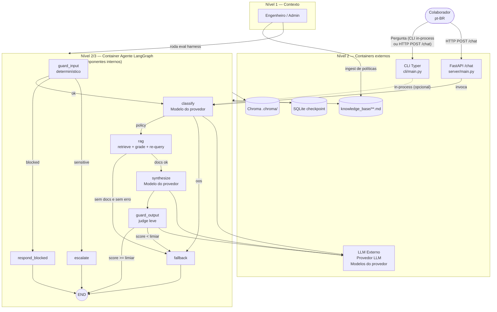
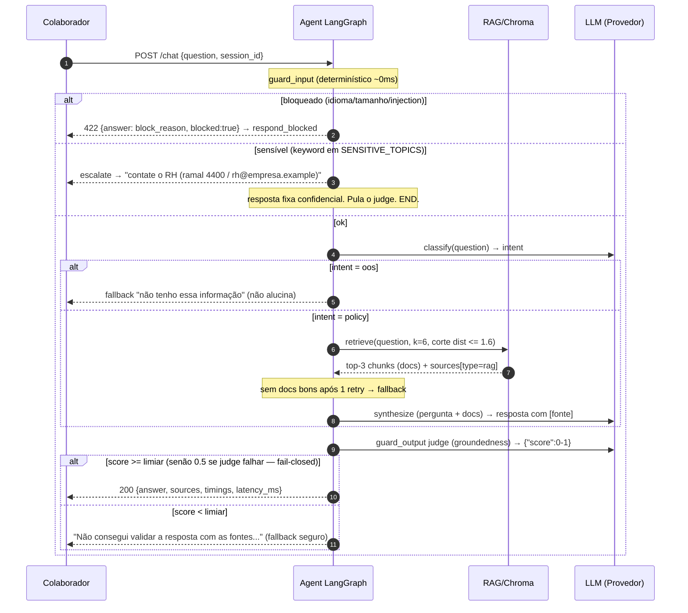

# DIAGRAMS.md — Diagramas do Agente RH/TI

Dois diagramas unificados, fiéis ao código:

- **C4** — visão estrutural única (contexto + containers + componentes do agente).
- **Sequência** — um único fluxo ponta a ponta, com os ramos de decisão do `agent/graph.py`.

> Nota de fidelidade: o roteador de entrada `_route_after_guard` tem o edge `escalate` saindo do `guard_input` (tópico sensível detectado por keyword-match em `guard_input.py:SENSITIVE_TOPICS`), **antes** do `classify`.

---

## 1. C4 — Contexto → Containers → Componentes

**Componentes (fonte):**
- `guard_input` — tamanho, idioma pt-BR, PII, prompt-injection; keyword de tópico sensível → `escalate`.
- `classify` — intent: `policy | oos`; JSON inválido → `oos` (fallback seguro, não inventa fonte).
- `rag` — top-k=6, corte `MAX_DISTANCE=1.6`, top-3 no contexto; retry 1x se docs ruins.
- `synthesize` — compõe pergunta + docs; exige citação de fonte.
- `guard_output` — LLM-judge de groundedness; falha → fallback determinístico.
- `fallback` / `escalate` / `respond_blocked` — respostas fixas seguras; **pulam o judge**.

---

## 2. Sequência — Fluxo ponta a ponta (com todos os ramos)

**Ramos de decisão (fonte):**
- `guard_input` → `respond_blocked` | `escalate` | `classify` (`_route_after_guard`, graph.py:19).
- `classify` → `policy`→rag | `oos`→fallback (`_route_after_classify`, graph.py:24).
- `rag` → sem docs→fallback | docs ok→synthesize (`_route_after_rag`, graph.py:32).
- `synthesize` → `guard_output` (judge) → END ou fallback (fail-closed).

---

## Referência rápida dos fluxos e suas decisões

| Fluxo | Intent/edge | Entrada | Saída | Fonte citada |
|---|---|---|---|---|
| Política | `policy` | dúvida de regra | resposta + `[fonte]` | RAG |
| Dado vivo fora do escopo | `oos` | saldo/ticket de funcionário | "não tenho" + contato RH | nenhuma |
| OOS/fallback | `oos` | fora do escopo | "não sei" honesto | nenhuma |
| Escalonar | keyword sensível | tema pessoal | contato humano | nenhuma |
| Block entrada | guardrail | injection/idioma | 422 | nenhuma |
| Judge falha | guardrail | score < limiar | fallback seguro | nenhuma |
