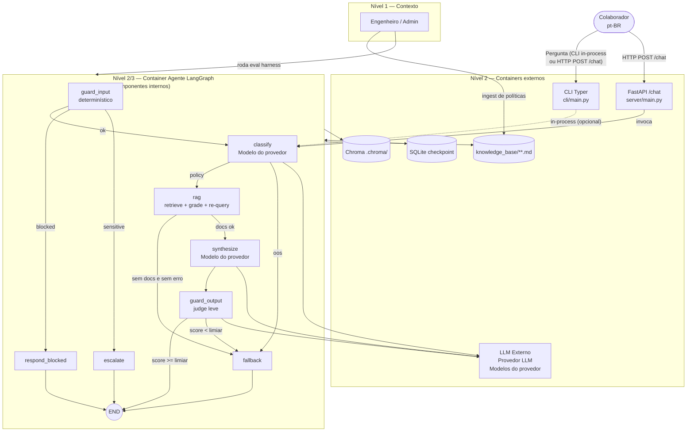
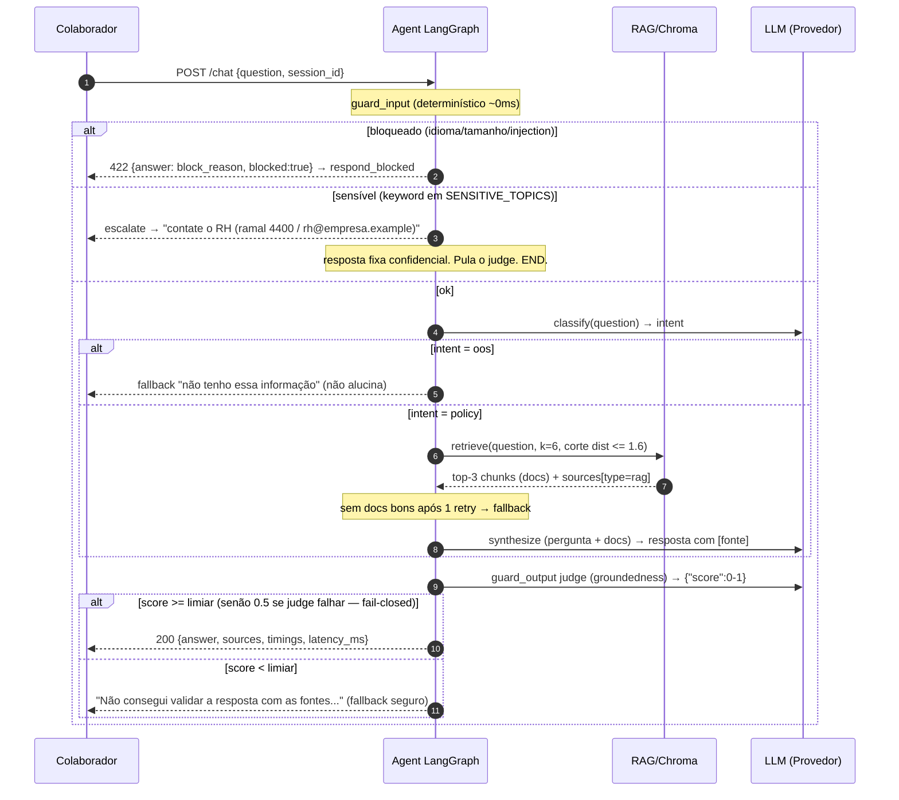

# Spec 01 — Arquitetura do Agente

## Diagramas (unificados)

Um diagrama C4 (estrutural) e um diagrama de sequência (fluxo ponta a ponta). Fonte canônica: `DIAGRAMS.md`.

### C4 — Contexto → Containers → Componentes



### Sequência — Fluxo ponta a ponta (com todos os ramos)



Memória: `SqliteSaver` checkpointer, `thread_id` = session id (CLI gera uuid; HTTP recebe header `X-Session-Id`).

> **Decisão:** o checkpointer é mantido **para auditoria e depuração** — permite rastrear o estado do grafo a cada nó por `session_id`/`trace_id` e sobrevive a restarts do servidor. Ele **não** alimenta contexto aos nós (`classify`/`synthesize` recebem só a pergunta atual), ou seja, não há memória conversacional ativa. Multi-turn real (referências anafóricas) exigiria injetar o histórico no prompt — fora de escopo neste momento; reaproveitar os checkpoints nessa direção fica registrado como evolução futura.

## Módulos

| Módulo | Responsabilidade |
|---|---|
| `agent/graph.py` | Definição do StateGraph, edges condicionais |
| `agent/state.py` | `AgentState` (TypedDict): question, intent, docs, answer, sources, blocked, latency_ms, trace_id |
| `agent/nodes/guard_input.py` | Validações determinísticas de entrada |
| `agent/nodes/classify.py` | Classificação de intenção (modelo do provedor, JSON mode) |
| `agent/nodes/rag.py` | Retrieve (Chroma, k=6) + rerank simples por score + montagem de contexto |
| `agent/nodes/synthesize.py` | Prompt de síntese com citações obrigatórias |
| `agent/nodes/guard_output.py` | Verifica groundedness; se falhar → fallback seguro |
| `agent/llm.py` | Fábrica de ChatOpenAI apontando p/ um provedor OpenAI-compatible; modelos via env |
| `rag/ingest.py` | Chunking por seção markdown (`##`, mantém header no chunk) + indexação Chroma |
| `rag/store.py` | Wrapper do Chroma persistente |
| `server/main.py` | Endpoint `/chat`, `/health`, `/metrics` |
| `cli/main.py` | CLI interativo (typer), chama HTTP ou roda in-process |

## Tipos de workflow aplicados

| Workflow | Onde aparece |
|---|---|
| **Routing** | `classify` → edges condicionais (policy→rag / oos→fallback) |
| **Evaluator-optimizer (parcial)** | `guard_output` avalia groundedness (heurística numérica + LLM-judge); falha → fallback fixo determinístico. **Não há re-síntese/otimização real** — sem loop de volta a `synthesize` no grafo |
| **Human-in-the-loop (preparado)** | nó `escalate` stub: intent sensível (demissão, assédio) → resposta padrão + sugestão de contato humano |
| **Retry condicional** | `rag_node` reformula a query 1x (remove pergunta secundária) se o corte por distância (`MAX_DISTANCE`) não retornar documentos bons. É lógica sequencial dentro do nó — **não é um subgrafo LangGraph aninhado** |

## Trade-offs de abordagem

### 1. LangGraph vs AgentExecutor
- **Escolha:** LangGraph.
- **Pró:** fluxo explícito, guardrails como nós, retry/timeout por nó, checkpointer p/ auditoria, observabilidade por edge.
- **Contra:** mais boilerplate; curva de aprendizado.
- **Quando mudaria:** protótipo descartável → AgentExecutor bastaria.

### 2. Classificador dedicado vs busca direta sem routing
- **Escolha:** nó `classify` dedicado (modelo do provedor, JSON mode).
- **Pró:** routing auditável; latência baixa; evita sintetizar para perguntas fora de escopo.
- **Contra:** classificação errada corta caminho correto; precisa dataset de intents.
- **Mitigação:** fallback `oos` (não alucina fonte); o harness mede intent accuracy.
- **Alternativa:** ReAct livre — mais flexível, mas p95 maior e menos previsível.

### 3. Chroma local vs vector DB gerenciado
- **Escolha:** Chroma persistido em `.chroma/`.
- **Pró:** zero infra, reproduzível, suficiente p/ ~30 docs.
- **Contra:** não escala horizontal; lock de arquivo em concorrência de escrita.
- **Sob carga:** read-only em runtime (ingest é job separado) → ok; se corpus crescer, migrar p/ pgvector/Qdrant.

### 4. Guardrails determinísticos + judge leve vs framework dedicado
- **Escolha:** regex/validators no input + modelo leve (judge) no output.
- **Pró:** transparente, barato, sem dependência pesada.
- **Contra:** judge adiciona ~300ms ao p95; menos robusto que NeMo.
- **Mitigação:** judge roda **assíncrono ao stream** no modo HTTP streaming; modo sync só bloqueia se score < limiar.

### 5. Modelo leve + modelo principal vs modelo único
- **Escolha:** modelo leve (classify, judge, re-query) + modelo principal (síntese final).
- **Pró:** custo ~10x menor nas etapas baratas; síntese com qualidade máxima.
- **Contra:** duas configs, dois pontos de falha.
- **Alternativa:** tudo no modelo leve — p50 menor, mas respostas finais piores em políticas ambíguas.

### 6. Reranker
- **Escolha:** score do Chroma + corte k=6 → top-3 no contexto.
- **Alternativa:** cross-encoder (bge-reranker) — melhor recall, +200ms e modelo local pesado. Corpus pequeno não justifica.

## Contratos

### POST /chat
```json
// request
{"question": "Quantos dias de férias tenho?", "employee_id": "E123"}
// response 200
{"answer": "...", "sources": [{"type": "rag", "ref": "politicas/ferias.md"}], "trace_id": "...", "latency_ms": 1234}
// response 422 (guardrail)  {"detail": "pergunta bloqueada", "reason": "..."}
// response 503 (fonte falhou) {"detail": "fonte indisponível", "source": "chroma"}
```

### Estado interno (AgentState)
```python
class AgentState(TypedDict):
    question: str
    employee_id: str | None
    intent: Literal["policy","oos"]
    docs: list[Document]
    answer: str
    sources: list[Source]
    blocked: bool
    retry_count: int
    latency_ms: float
    trace_id: str
```
